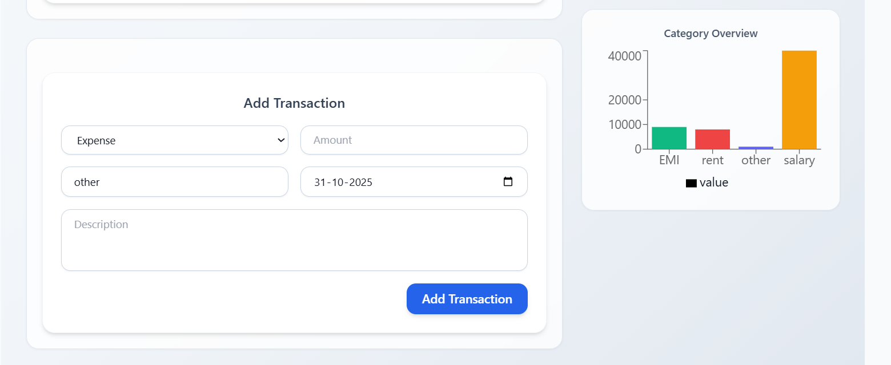

# 💸 Expense Tracker Application

A fully responsive **MERN Stack Expense Tracker** that allows users to manage income and expenses efficiently.
It provides smooth UI interactions, real-time data updates, and a modern responsive design — optimized for both desktop and mobile.

## 🚀 Live Demo

🔗 [View Deployed App](https://your-deployed-link.com)

---

## 🛠️ Tech Stack

**Frontend:** React, Redux Toolkit, Tailwind CSS
**Backend:** Node.js, Express.js, MongoDB
**Database:** MongoDB Atlas
**State Management:** Redux Toolkit

---

## ⚙️ Installation & Setup

Follow the steps below to run the project locally:

### 1. Clone the repository

```bash
git clone https://github.com/your-username/expense-tracker.git
```

2. Install dependencies
   Frontend

```bash
cd frontend
npm install
```

Backend

```bash
cd ../backend
npm install
```

3. Setup environment variables

Create a .env file in the backend folder with the following variables:

```bash
PORT=5000
MONGO_URL=your_mongodb_connection_string
```

4. Start the development servers
   Start Backend

```bash
npm run dev
```

Start Frontend

````bash
npm run dev
```


-Frontend runs on: http://localhost:5173
-Backend runs on: http://localhost:5000


📱 Features

-💰 Add, edit, and delete transactions
-📊 View categorized income and expense lists
-🔄 Real-time updates using Redux
-📅 Filter by date and category
-🧠 Smart form validation and error handling
-🎨 Fully responsive UI built with Tailwind CSS
-☁️ MongoDB Atlas for persistent data storage

````

📸 Screenshots




👨‍💻 Author
Developed by [Sharad Paradhi](https://github.com/sharadParadhi)
💚 Passionate about building modern, scalable full-stack applications.
